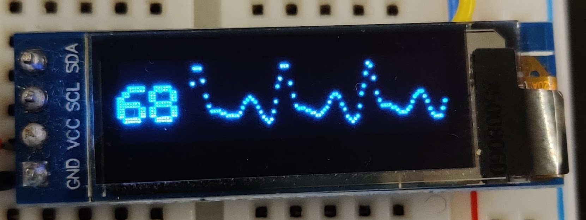

# Simple Heart_sensor

Program that runns a simple heart sensor and does some signalprosecing on it. The filtered signal is displayed on an lcd and calculated into a heartrate  
Made as apart of my digital signalprocesing course

